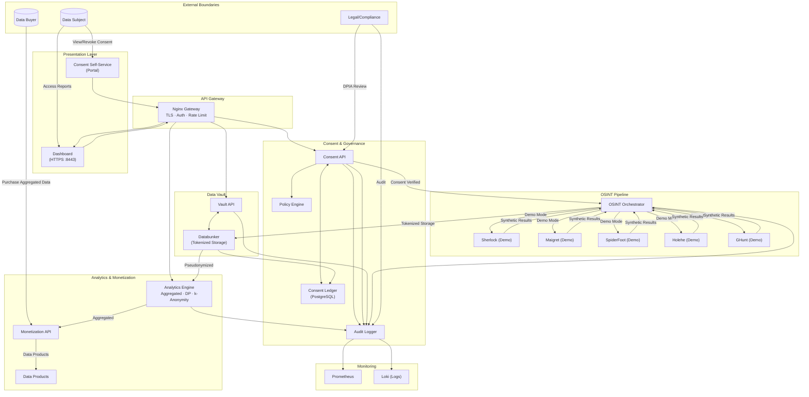
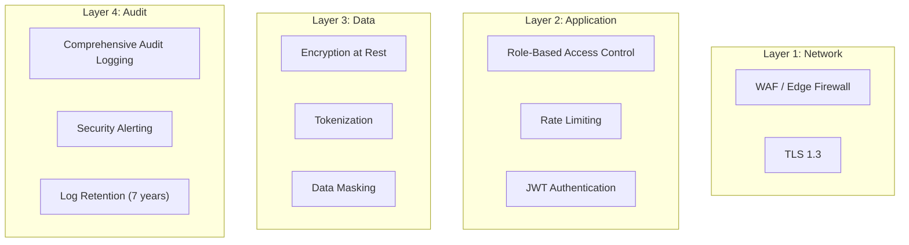

# ConsentVault OSINT Stack - Architecture Diagram



## Data Flow Legend

| Flow Type | Description | Color |
|-----------|-------------|-------|
| → | Consent-verified data flow | Blue |
| --► | Aggregated/anonymized output | Green |
| ··► | Synthetic/demo data flow | Gray |
| --- | Audit logging | Orange |

## Component Descriptions

### Core Services
- **Consent API**: REST API for consent management, verification, and revocation
- **Consent Ledger**: PostgreSQL database storing consent records and policies
- **Databunker**: Tokenized storage for personal data with encryption at rest
- **OSINT Orchestrator**: Pipeline controller with consent gating

### OSINT Tools (Demo Configuration)
- **Sherlock**: Username search (demo mode only)
- **Maigret**: Profile enumeration (demo mode only)
- **SpiderFoot**: Automated OSINT (demo mode only)
- **Holehe**: Email enumeration (demo mode only)
- **GHunt**: Google account enumeration (demo mode only)

### Analytics & Monetization
- **Analytics Engine**: Aggregates data with Differential Privacy and k-Anonymity
- **Monetization API**: Manages data product sales with consent verification

## Network Segmentation

```
┌─────────────────────────────────────────────────────────────────┐
│                     CONSENTVAULT NETWORK                         │
│  Subnet: 172.28.0.0/16                                           │
├─────────────────────────────────────────────────────────────────┤
│                                                                  │
│  ┌──────────────────────────────────────────────────────────┐  │
│  │              INTERNAL SERVICES (No External Access)       │  │
│  │                                                           │  │
│  │   consent-ledger  │  databunker  │  osint-orchestrator  │  │
│  │   consent-api     │  vault-api   │  analytics-engine   │  │
│  │                                                           │  │
│  └──────────────────────────────────────────────────────────┘  │
│                                                                  │
│  ┌──────────────────────────────────────────────────────────┐  │
│  │              GATEWAY SERVICES (External via Nginx)       │  │
│  │                                                           │  │
│  │   dashboard  │  spiderfoot-ui  │  monetization-api      │  │
│  │                                                           │  │
│  └──────────────────────────────────────────────────────────┘  │
│                                                                  │
│  ┌──────────────────────────────────────────────────────────┐  │
│  │              MONITORING (Internal Only)                   │  │
│  │                                                           │  │
│  │   prometheus  │  loki  │  audit-logs                    │  │
│  │                                                           │  │
│  └──────────────────────────────────────────────────────────┘  │
│                                                                  │
└─────────────────────────────────────────────────────────────────┘
```

## Security Layers


