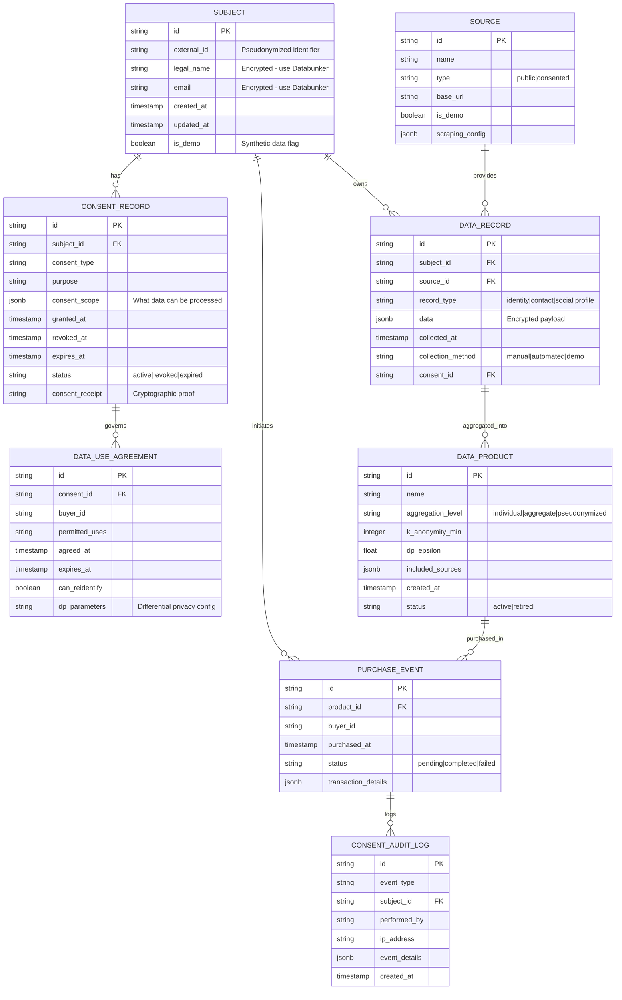

# ConsentVault OSINT Stack - Data Models & Schema

## Entity Relationship Diagram



## SQL Schema Definitions

### Subject Table

```sql
CREATE TABLE subject (
    id UUID PRIMARY KEY DEFAULT gen_random_uuid(),
    external_id VARCHAR(255) UNIQUE NOT NULL,
    legal_name_token VARCHAR(512),
    email_token VARCHAR(512),
    created_at TIMESTAMP WITH TIME ZONE DEFAULT NOW(),
    updated_at TIMESTAMP WITH TIME ZONE DEFAULT NOW(),
    is_demo BOOLEAN DEFAULT true,
    
    CONSTRAINT demo_only_check CHECK (
        is_demo = true OR (
            legal_name_token IS NOT NULL 
            AND email_token IS NOT NULL
        )
    )
);

CREATE INDEX idx_subject_external_id ON subject(external_id);
CREATE INDEX idx_subject_is_demo ON subject(is_demo);
```

### Consent Record Table

```sql
CREATE TABLE consent_record (
    id UUID PRIMARY KEY DEFAULT gen_random_uuid(),
    subject_id UUID NOT NULL REFERENCES subject(id),
    consent_type VARCHAR(100) NOT NULL,
    purpose VARCHAR(500) NOT NULL,
    consent_scope JSONB NOT NULL DEFAULT '{}',
    granted_at TIMESTAMP WITH TIME ZONE DEFAULT NOW(),
    revoked_at TIMESTAMP WITH TIME ZONE,
    expires_at TIMESTAMP WITH TIME ZONE,
    status VARCHAR(20) NOT NULL DEFAULT 'active',
    consent_receipt VARCHAR(512),
    
    CONSTRAINT valid_status CHECK (
        status IN ('active', 'revoked', 'expired')
    )
);

CREATE INDEX idx_consent_subject ON consent_record(subject_id);
CREATE INDEX idx_consent_status ON consent_record(status);
CREATE INDEX idx_consent_granted ON consent_record(granted_at);

CREATE TABLE consent_audit_log (
    id UUID PRIMARY KEY DEFAULT gen_random_uuid(),
    event_type VARCHAR(50) NOT NULL,
    subject_id UUID REFERENCES subject(id),
    performed_by VARCHAR(255),
    ip_address INET,
    event_details JSONB DEFAULT '{}',
    created_at TIMESTAMP WITH TIME ZONE DEFAULT NOW()
);

CREATE INDEX idx_audit_subject ON consent_audit_log(subject_id);
CREATE INDEX idx_audit_created ON consent_audit_log(created_at);
```

### Source Table

```sql
CREATE TABLE source (
    id UUID PRIMARY KEY DEFAULT gen_random_uuid(),
    name VARCHAR(255) NOT NULL,
    type VARCHAR(50) NOT NULL,
    base_url VARCHAR(500),
    is_demo BOOLEAN DEFAULT true,
    scraping_config JSONB DEFAULT '{}',
    
    CONSTRAINT valid_source_type CHECK (
        type IN ('public', 'consented')
    )
);

CREATE INDEX idx_source_type ON source(type);
CREATE INDEX idx_source_demo ON source(is_demo);
```

### Data Record Table

```sql
CREATE TABLE data_record (
    id UUID PRIMARY KEY DEFAULT gen_random_uuid(),
    subject_id UUID NOT NULL REFERENCES subject(id),
    source_id UUID REFERENCES source(id),
    record_type VARCHAR(50) NOT NULL,
    data JSONB NOT NULL,
    collected_at TIMESTAMP WITH TIME ZONE DEFAULT NOW(),
    collection_method VARCHAR(50) DEFAULT 'demo',
    consent_id UUID REFERENCES consent_record(id),
    
    CONSTRAINT valid_collection CHECK (
        collection_method IN ('manual', 'automated', 'demo', 'synthetic')
    )
);

CREATE INDEX idx_data_subject ON data_record(subject_id);
CREATE INDEX idx_data_source ON data_record(source_id);
CREATE INDEX idx_data_type ON data_record(record_type);
CREATE INDEX idx_data_consent ON data_record(consent_id);
```

### Data Product Table

```sql
CREATE TABLE data_product (
    id UUID PRIMARY KEY DEFAULT gen_random_uuid(),
    name VARCHAR(255) NOT NULL,
    aggregation_level VARCHAR(50) NOT NULL,
    k_anonymity_min INTEGER DEFAULT 5,
    dp_epsilon FLOAT DEFAULT 1.0,
    included_sources JSONB DEFAULT '[]',
    created_at TIMESTAMP WITH TIME ZONE DEFAULT NOW(),
    status VARCHAR(20) DEFAULT 'active',
    
    CONSTRAINT valid_aggregation CHECK (
        aggregation_level IN ('individual', 'aggregate', 'pseudonymized')
    )
);

CREATE INDEX idx_product_aggregation ON data_product(aggregation_level);
CREATE INDEX idx_product_status ON data_product(status);
```

### Purchase Event Table

```sql
CREATE TABLE purchase_event (
    id UUID PRIMARY KEY DEFAULT gen_random_uuid(),
    product_id UUID NOT NULL REFERENCES data_product(id),
    buyer_id VARCHAR(255) NOT NULL,
    purchased_at TIMESTAMP WITH TIME ZONE DEFAULT NOW(),
    status VARCHAR(20) DEFAULT 'pending',
    transaction_details JSONB DEFAULT '{}',
    
    CONSTRAINT valid_purchase_status CHECK (
        status IN ('pending', 'completed', 'failed')
    )
);

CREATE INDEX idx_purchase_product ON purchase_event(product_id);
CREATE INDEX idx_purchase_buyer ON purchase_event(buyer_id);
CREATE INDEX idx_purchase_status ON purchase_event(status);
```

### Data Use Agreement Table

```sql
CREATE TABLE data_use_agreement (
    id UUID PRIMARY KEY DEFAULT gen_random_uuid(),
    consent_id UUID NOT NULL REFERENCES consent_record(id),
    buyer_id VARCHAR(255) NOT NULL,
    permitted_uses TEXT NOT NULL,
    agreed_at TIMESTAMP WITH TIME ZONE DEFAULT NOW(),
    expires_at TIMESTAMP WITH TIME ZONE,
    can_reidentify BOOLEAN DEFAULT false,
    dp_parameters JSONB DEFAULT '{}'
);

CREATE INDEX idx_agreement_consent ON data_use_agreement(consent_id);
CREATE INDEX idx_agreement_buyer ON data_use_agreement(buyer_id);
```

## Data Flow JSON Schemas

### Consent Request Schema

```json
{
  "$schema": "http://json-schema.org/draft-07/schema#",
  "type": "object",
  "required": ["subject_id", "consent_type", "purpose"],
  "properties": {
    "subject_id": {
      "type": "string",
      "format": "uuid"
    },
    "consent_type": {
      "type": "string",
      "enum": ["osint_collection", "analytics", "monetization", "research"]
    },
    "purpose": {
      "type": "string",
      "minLength": 10,
      "maxLength": 500
    },
    "consent_scope": {
      "type": "array",
      "items": {
        "type": "string",
        "enum": ["identity", "contact", "social", "employment", "location"]
      }
    },
    "expires_at": {
      "type": "string",
      "format": "date-time"
    }
  }
}
```

### Consent Receipt Schema

```json
{
  "$schema": "http://json-schema.org/draft-07/schema#",
  "type": "object",
  "required": ["receipt_id", "subject_id", "consent_id", "granted_at"],
  "properties": {
    "receipt_id": {
      "type": "string",
      "format": "uuid"
    },
    "subject_id": {
      "type": "string",
      "format": "uuid"
    },
    "consent_id": {
      "type": "string",
      "format": "uuid"
    },
    "consent_type": {
      "type": "string"
    },
    "purpose": {
      "type": "string"
    },
    "granted_at": {
      "type": "string",
      "format": "date-time"
    },
    "expires_at": {
      "type": "string",
      "format": "date-time"
    },
    "signature": {
      "type": "string",
      "description": "Cryptographic proof of consent"
    }
  }
}
```

### OSINT Result Schema

```json
{
  "$schema": "http://json-schema.org/draft-07/schema#",
  "type": "object",
  "required": ["query", "source", "mode"],
  "properties": {
    "query": {
      "type": "string"
    },
    "source": {
      "type": "string",
      "enum": ["sherlock", "maigret", "spiderfoot", "holehe", "ghunt"]
    },
    "mode": {
      "type": "string",
      "enum": ["demo", "synthetic", "production"]
    },
    "results": {
      "type": "array",
      "items": {
        "type": "object",
        "properties": {
          "platform": {"type": "string"},
          "url": {"type": "string", "format": "uri"},
          "timestamp": {"type": "string", "format": "date-time"}
        }
      }
    },
    "consent_verified": {
      "type": "boolean"
    },
    "collection_timestamp": {
      "type": "string",
      "format": "date-time"
    }
  }
}
```

### Aggregated Data Product Schema

```json
{
  "$schema": "http://json-schema.org/draft-07/schema#",
  "type": "object",
  "required": ["product_id", "aggregation_method"],
  "properties": {
    "product_id": {
      "type": "string",
      "format": "uuid"
    },
    "product_name": {
      "type": "string"
    },
    "aggregation_method": {
      "type": "string",
      "enum": ["differential_privacy", "k_anonymity", "generalization"]
    },
    "privacy_parameters": {
      "type": "object",
      "properties": {
        "epsilon": {"type": "number", "minimum": 0, "maximum": 1},
        "k": {"type": "integer", "minimum": 1},
        "l_diversity": {"type": "integer", "minimum": 1}
      }
    },
    "record_count": {
      "type": "integer",
      "minimum": 0
    },
    "data_schema": {
      "type": "object"
    }
  }
}
```
