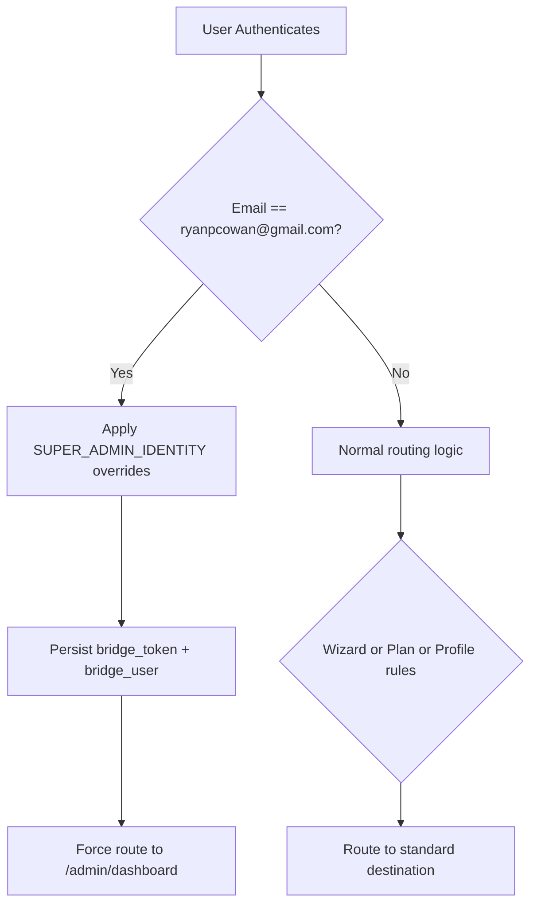

# Super Admin Override Architecture

## Canonical Super Admin Identity Object

The platform now uses a canonical server-side identity constant for the super-admin account:

```js
const SUPER_ADMIN_IDENTITY = Object.freeze({
  email: 'ryanpcowan@gmail.com',
  role: 'superadmin',
  plan: 'infinite',
  permissions: ['*'],
  tenant: 'root',
});
```

This identity is enforced through `withSuperAdminOverrides(user)` and applied before token signing and before user payloads are returned by auth endpoints.

## Routing Flow Diagram



### Client-side route guards

- `public/auth-callback.html`: top-priority super-admin redirect to `/admin/dashboard`
- `public/bridge-auth.js` (`getPostLoginRoute`): hard override for super-admin email
- `public/onboarding.html`: login/register destination override for super-admin email

## JWT Structure Map (With Enforced Overrides)

### Access token (`/auth/login`, `/auth/token-exchange`, OAuth paths)

```json
{
  "sub": "<user-id>",
  "email": "ryanpcowan@gmail.com",
  "role": "superadmin",
  "plan": "infinite",
  "permissions": ["*"],
  "tenant": "root",
  "iat": "<issued-at>",
  "exp": "<expires-at>"
}
```

### Refresh token (`/auth/login`, `/auth/register`)

```json
{
  "sub": "<user-id>",
  "email": "ryanpcowan@gmail.com",
  "type": "refresh",
  "role": "superadmin",
  "plan": "infinite",
  "permissions": ["*"],
  "tenant": "root",
  "iat": "<issued-at>",
  "exp": "<expires-at>"
}
```

## Regression Test Suite

Test file: `tests/super-admin-routing.test.js`

Coverage includes:

- Login response identity enforcement (`role`, `plan`, `permissions`, `tenant`)
- Access token claim enforcement
- Refresh token claim enforcement
- `/auth/verify` response enforcement
- `/auth/me` response enforcement

These tests guarantee the override remains deterministic even if DB role fields drift.

## Security Note: Why This Override Is Safe and Deterministic

- **Single principal scope**: Override applies only to one exact canonical email.
- **Server-authoritative claims**: Security-critical fields are set server-side before JWT signing.
- **Deterministic behavior**: Same email always produces the same elevated identity object.
- **No tenant ambiguity**: `tenant` is pinned to `root`, eliminating tenant/agent fallback branches.
- **Fail-safe precedence**: Super-admin check runs before downstream routing logic.
- **Auditable implementation**: Logic is centralized and test-covered in a dedicated regression suite.

## Operational Reminder

Restart the auth service after deployment so the updated identity override logic is active in runtime.
