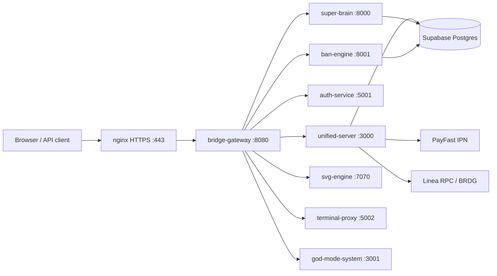
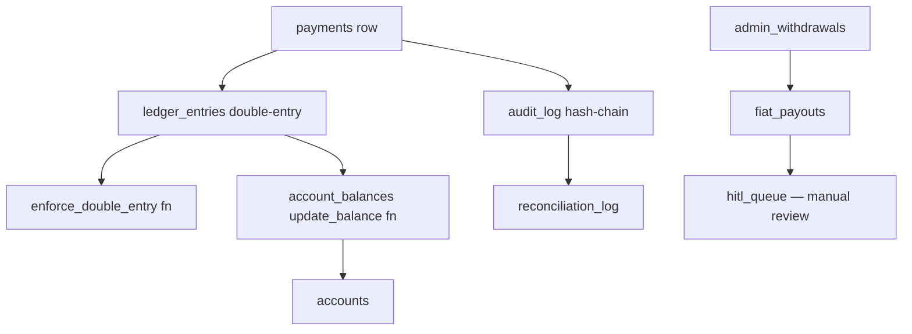
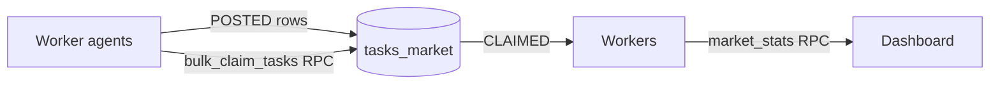

# 03 — Schematics

_Last updated: 2026-04-17_

Architecture and data-flow diagrams.

## Top-level process topology (VPS)



Sources: `ecosystem.config.js:L26-L143`; `gateway.js:L35`; user memory `reference_bridgeai_vps.md` (nginx split HTTP/HTTPS).

## Edge surface (Vercel)

```mermaid
graph LR
    Browser --> Vercel[Vercel cleanUrls=true]
    Vercel --> StaticHTML[public/*.html]
    Vercel -->|/api/*| APIFN[api/index.js ~3600 lines]
    APIFN --> Supabase[(Supabase)]
    APIFN --> PayFast
    Vercel -->|rewrite /apps| A50[/50-applications]
    Vercel -->|rewrite /dashboard| AOE[/aoe-dashboard]
    Vercel -->|rewrite /treasury-dash| TreasuryDash[/treasury-dashboard]
    Vercel -->|rewrite /health| APIFN
    Vercel -->|rewrite /swarm/*| APIFN
    Vercel -->|rewrite /orchestrator/status| APIFN
    Vercel -->|rewrite /billing| APIFN
```

Sources: `vercel.json:L69-L110` (rewrites); `vercel.json:L5-L13` (cleanUrls + serverless function).

## Self-healing upgrade pipeline

```
AUDIT → AUTO-REFACTOR → TEST → DEPLOY → EVALUATE
  │                                         │
  └──────── loop while health < 95% ────────┘
```

Source: `pipeline/PIPELINE.md:L1-L25`.

## Treasury flow



Sources: `supabase/migrations/20260411000000_hardened_treasury_schema.sql:L64-L228`; `supabase/migrations/20260414100000_recovery_infrastructure.sql:L13`.

## Tasks-market claim flow



Sources: `supabase/migrations/20260417010000_bulk_claim_tasks.sql`; `supabase/migrations/20260417000000_tasks_market_perf.sql`.

## ConsentVault OSINT stack

See `consent-osint-stack/docs/architecture.md` for the full mermaid diagram of the consent / OSINT stack (Dashboard → Nginx gateway → Consent API + PolicyEngine → Databunker vault) (src: `consent-osint-stack/docs/architecture.md:L1-L40`).

## LLM provider fallback chain

```
Kilo (free) → Claude Sonnet 4.6 → OpenRouter → OpenAI
```

Controlled by `LLM_PROVIDER_ORDER` env; client in `lib/llm-client.js` (src: `.env.example:L56`; `SESSION-HANDOFF.md` — "Key Architecture").

## Sources

- `ecosystem.config.js`
- `gateway.js`
- `vercel.json`
- `supabase/migrations/20260411000000_hardened_treasury_schema.sql`
- `supabase/migrations/20260414100000_recovery_infrastructure.sql`
- `supabase/migrations/20260417000000_tasks_market_perf.sql`
- `supabase/migrations/20260417010000_bulk_claim_tasks.sql`
- `pipeline/PIPELINE.md`
- `consent-osint-stack/docs/architecture.md`
- `SESSION-HANDOFF.md`
- User memory: `reference_bridgeai_vps.md`
